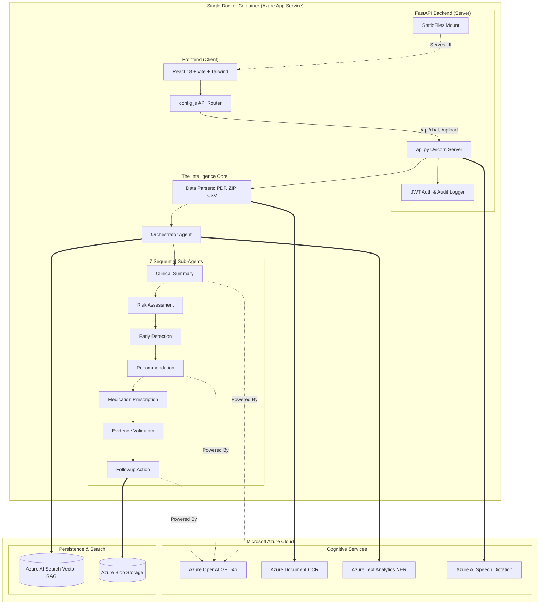

# HDDS Agentic Clinical Intelligence Platform

An AI-powered **Hospital Discharge Data Summary (HDDS)** platform that runs patient records through a pipeline of coordinated AI agents to produce **clinician-reviewable** medical insights. 

> **Responsible-AI note:** This is a prototype using **synthetic** patient data. Every output is decision support for **clinician review — never a final diagnosis or treatment decision.**

---

## 🏗️ Enterprise Architecture (Production Ready)

The application is built on a **Single-Container Cloud Deployment** model, heavily utilizing the Microsoft Azure Foundry to ensure enterprise-grade security and HIPAA compliance.

### Core Architecture
1. **Dockerized Deployment**: The React frontend (Vite/Tailwind) and FastAPI Python backend have been unified into a single, highly-efficient `Dockerfile`. This eliminates CORS issues and allows for immediate deployment to **Azure Container Apps**.
2. **Azure AI Search (Vector RAG)**: Clinical guidelines and unstructured patient histories are mapped to an enterprise-grade vector database, mathematically guaranteeing grounded, hallucination-free AI responses via RAG (Retrieval-Augmented Generation).
3. **Azure Blob Storage**: Uploaded patient documents (PDFs, ZIPs), transcripts, and JSON outputs are securely synchronized and encrypted at rest in Azure Blob Storage.
4. **Microsoft AI Integrations**:
    - **Azure Document Intelligence (OCR):** Extracts text from scanned medical PDFs.
    - **Azure Text Analytics for Health:** Deep clinical Named Entity Recognition (NER).
    - **Azure AI Speech:** Real-time doctor dictation and audio transcription.
    - **Azure OpenAI (GPT-4o):** Powers the 7 clinical sub-agents that analyze the data.

---

## 🚀 Quick Start (Local Demo)

You can run the entire platform locally in minutes using Docker.

```bash
# 1. Clone the repository
git clone https://github.com/Kai23-dev/HDDS_Agentic_Clinical_Intelligence_Platform.git
cd HDDS_Agentic_Clinical_Intelligence_Platform/hdds_clinical_intelligence

# 2. Add your API keys
cp .env.example .env
# Open .env and add your Azure Search, Storage, and OpenAI credentials

# 3. Build and Run the unified container
docker build -t hdds-app .
docker run -p 8000:8000 --env-file .env hdds-app
```

**Access the EY Dashboard at:** `http://localhost:8000/`

*(Note: If you do not have Docker installed, you can still run `pip install -r requirements.txt && python api.py` in one terminal, and `cd frontend && npm run dev` in another).*

---

## 🔐 Test Accounts (Prototype Auth)

| Role | Email | Password |
|------|-------|----------|
| Doctor | `doctor@ey.com` | `password123` |
| Admin | `admin@ey.com` | `admin` |

---

## 🧠 Full System Architecture



- **`api.py`** — The unified server. Serves the React Dashboard AND the backend API routes (`/api/upload`, `/api/chat`, etc.).
- **`agents/orchestrator_agent.py`** — The brain. Orchestrates the flow from Azure AI Search (for guidelines) to Azure Document Intelligence (for PDFs), and sequentially triggers the 7 clinical sub-agents to build the final JSON payload.

---

## 📚 Documentation & Roadmap

- **[SETUP.md](hdds_clinical_intelligence/SETUP.md)** — Detailed Azure deployment guide.
- **[ROADMAP.md](hdds_clinical_intelligence/ROADMAP.md)** — Honest gap analysis and path to real clinical use.
- **[CLAUDE.md](hdds_clinical_intelligence/CLAUDE.md)** — Architecture conventions for contributors.

---

*Disclaimer: Prototype built for demonstration on synthetic data. Not intended for real clinical diagnosis or treatment decisions.*
